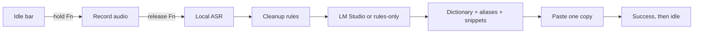

# JiSpr Flow

Local-first desktop dictation for macOS, Windows, and Linux. Speak into a
push-to-talk or hands-free session; local Whisper transcribes; deterministic
rules and an optional local LM Studio model clean the text; JiSpr inserts one
polished copy into the focused app.

Audio stays on your computer. Transcripts are sent only to your configured
local LM Studio server, if enabled. Known cloud AI endpoints are refused.

> The product is **JiSpr Flow**. The command and Python package remain
> `local-flow` and `local_flow`.

## Quick start: Apple Silicon Mac

Requirements: [uv](https://docs.astral.sh/uv/), macOS microphone permissions,
and optionally [LM Studio](https://lmstudio.ai/) with a local instruct model
loaded and its server running.

```bash
git clone <repository-url>
cd jispr_flow
uv sync --all-extras
uv run local-flow setup
```

For the recommended accurate local setup, edit
`~/.config/local-flow/config.toml` or use the native Settings app:

```toml
asr_profile = "accuracy"
asr_language = "en"

# Optional local-LLM cleanup. Use rules to run without LM Studio.
polish_backend = "lmstudio"
lmstudio_model = ""

floating_pill = true
pill_style = "compact"
hotkey = "fn"
```

Then verify and run:

```bash
uv run local-flow check
uv run local-flow demo
uv run local-flow run --pill
```

Hold **Fn**, speak, and release. Press **Esc** while recording to discard.
The first MLX run downloads the selected model once; later launches use the
local cache.

Without a prior `uv sync`, the equivalent one-shot command is:

```bash
uv run --extra mlx-asr --extra audio --extra desktop local-flow run --pill
```

## What a session does



The compact floating surface stays as a thin idle bar. It expands while
recording, shows processing after release, briefly confirms success, and then
returns to idle. Use `--no-pill` to hide it or set
`LOCAL_FLOW_PILL_STYLE=expanded` for the larger labeled version.

LM Studio does **not** run Whisper. JiSpr runs MLX/faster-whisper directly for
speech recognition and uses LM Studio only for optional text cleanup and
transforms.

Parakeet v3 is also loaded directly by JiSpr; LM Studio never receives audio.
Install its adapter and FFmpeg, then select it as a custom backend:

```bash
brew install ffmpeg
uv sync --extra parakeet-asr
```

```toml
asr_profile = "custom"
asr_backend = "mlx-parakeet"
asr_model = "mlx-community/parakeet-tdt-0.6b-v3"
asr_language = "auto"
```

Parakeet v3 manages multilingual recognition itself. It does not currently
accept JiSpr's Whisper vocabulary prompt; dictionary terms are still supplied
to local polish and deterministically enforced on the final text.

## Recognition profiles

| Profile | Model | Best for |
|---|---|---|
| `accuracy` | MLX Whisper Large-v3-Turbo | recommended accuracy/speed balance on the evaluated Mac |
| `fast` | MLX Whisper Small.en | lowest latency and memory use |
| `custom` | configured backend and model | faster-whisper, multilingual, or custom paths |

```toml
asr_profile = "fast"
# or
asr_profile = "accuracy"
```

On one 11.3-second technical sample, Turbo reduced WER from `0.190` to
`0.048` versus Small.en while median transcription increased from `0.129s`
to `0.153s`. Results depend on hardware and voice; reproduce them with:

```bash
uv run local-flow benchmark-asr sample.wav --profile fast \
  --reference "expected words" --json /tmp/fast.json
uv run local-flow benchmark-asr sample.wav --profile accuracy \
  --reference "expected words" --json /tmp/accuracy.json
```

See [MLX evaluation](docs/asr/MLX_EVALUATION.md) for the complete methodology.

## Model benchmark

`benchmark-models` freezes one ASR transcript per recording, then sends that
byte-identical text through each requested LM Studio model. Raw audio,
transcripts, and review sheets belong under the ignored `benchmarks/private/`
directory.

```bash
uv run local-flow benchmark-models benchmarks/private/corpus.jsonl \
  --output benchmarks/private/parakeet-v3 \
  --polisher gemma-4-26B-A4B-it-UD-Q4_K_M.gguf \
  --polisher Qwen3.5-35B-A3B-Q4_K_M.gguf \
  --polisher Qwen3.5-9B-Q4_K_M.gguf
```

Complete the generated blind review sheet before applying `--reviews` together
with the saved `--benchmark-report`; JiSpr evaluates those exact saved outputs
without calling ASR or LM Studio again. It never emits a recommendation before
every output has a safety decision. To compare Whisper Turbo with the winner,
rerun the same manifest with
`--asr-backend mlx-whisper --asr-model mlx-community/whisper-large-v3-turbo`.
See [the benchmark guide](benchmarks/README.md) for the full procedure.

## Names, vocabulary, and corrections

JiSpr uses three safe correction layers:

1. dictionary terms bias Whisper before decoding;
2. the local polish model is told the canonical spellings;
3. dictionary and snippet rules enforce the final output.

The dictionary fixes exact spelling and casing. Use snippets as explicit
aliases for pronunciation-dependent ASR results; JiSpr intentionally avoids
broad fuzzy autocorrect that could change valid words.

`~/.local/share/local-flow/dictionary.json`:

```json
{
  "terms": ["JiSpr Flow", "PostgreSQL", "Kubernetes"]
}
```

`~/.local/share/local-flow/snippets.json`:

```json
{
  "snippets": {
    "juiceflow": "JiSpr Flow",
    "GSPR Flow": "JiSpr Flow",
    "sig block": "Best regards,\nJay"
  }
}
```

You can also say `add JiSpr Flow to the dictionary`, or review terms mined
from local history:

```bash
uv run local-flow learn
uv run local-flow learn --add 1 2
```

## Everyday commands

| Command | Purpose |
|---|---|
| `uv run local-flow run --pill` | push-to-talk dictation with the macOS bar |
| `uv run local-flow run --mode hands-free` | VAD-controlled dictation |
| `uv run local-flow check` | inspect models, LM Studio, microphone, and desktop setup |
| `uv run local-flow transcribe memo.m4a --polish` | transcribe an existing audio file |
| `uv run local-flow history` | list local dictation history |
| `uv run local-flow history --retry 1` | re-polish and insert a previous rough transcript |
| `uv run local-flow recover` | process audio preserved after a crash |
| `uv run local-flow transform Polish --selection` | rewrite selected text in place |
| `uv run local-flow pad --window` | open the local Markdown scratchpad |
| `uv run local-flow stats` | show local words, streaks, and app statistics |
| `uv run local-flow tray` | start the menu-bar app |
| `uv run local-flow settings` | open native macOS Settings & Personalization |
| `uv run local-flow benchmark-models …` | freeze ASR and compare local polishers |

Run `uv run local-flow --help` or `<command> --help` for every option.

## Native macOS app (local beta)

JiSpr now includes a SwiftUI menu-bar app under `macos/JiSpr`. It keeps the
Python dictation engine as the local source of truth, while providing a pastel
beige/sage/orange settings window, live recording status, quick style/language
choices, Launch at Login, and recovery when the engine stops unexpectedly.
Closing Settings leaves the small JiSpr waveform in the upper-right menu bar;
use the menu's **Quit JiSpr** action to stop the app.

```bash
uv sync --all-extras
xcodegen generate --spec macos/JiSpr/project.yml
./script/build_and_run.sh --verify
```

The debug app resolves the engine from this checkout's `.venv/bin/local-flow`.
The Release pipeline bundles that engine and its Python runtime into the app:

```bash
./script/package_beta.sh
```

Without a Developer ID certificate this produces an ad-hoc DMG for local
validation only. With Developer ID and a notarytool Keychain profile it creates
the signed, notarized friend beta. See
[Beta distribution](docs/BETA_DISTRIBUTION.md). Grant the launched **JiSpr** app
Microphone, Accessibility, and Input Monitoring access when macOS asks. The
legacy `local-flow tray` and `local-flow settings` commands remain available as
fallbacks during beta testing.

## Important settings

Copy [.env.example](.env.example) for the complete annotated list. Environment
variables override [local-flow.example.toml](local-flow.example.toml), which
overrides application defaults.

| Setting | Values / purpose |
|---|---|
| `LOCAL_FLOW_ASR_PROFILE` | `accuracy`, `fast`, or `custom` |
| `LOCAL_FLOW_POLISH_BACKEND` | `lmstudio` or deterministic `rules` |
| `LOCAL_FLOW_LMSTUDIO_MODEL` | loaded local instruct model; empty auto-selects |
| `LOCAL_FLOW_LMSTUDIO_SYSTEM_PROMPT` | optional extra cleanup instructions |
| `LOCAL_FLOW_MODE` | `push-to-talk` or `hands-free` |
| `LOCAL_FLOW_HOTKEY` | `fn`, `space`, `f9`, or another supported key |
| `LOCAL_FLOW_CLEANUP_LEVEL` | `none`, `light`, `medium`, or `high` |
| `LOCAL_FLOW_INSERT_METHOD` | `auto`, `paste`, `type`, or `clipboard` |
| `LOCAL_FLOW_MIC_PRIORITY` | comma-separated device-name preferences |
| `LOCAL_FLOW_VAD_PRESET` | `normal` or `whisper` for quiet speech |
| `LOCAL_FLOW_DATA_DIR` | personalization, history, notes, and recovery data |

Personal data defaults to `~/.local/share/local-flow`. Do not commit `.env`,
history, dictionaries, notes, or generated audio.

## Permissions and common fixes

On macOS, grant the process you launch—your terminal for CLI use, or **JiSpr**
for the native beta—**Microphone**, **Accessibility**, and **Input Monitoring**
access under System Settings → Privacy & Security, then restart it.
In JiSpr, open **General → Permissions** and click **Request Access** first; this
registers the native app so it appears in the corresponding macOS privacy list.

Settings writes validated TOML only. Legacy `.env` settings remain read-only
until migrated with `uv run local-flow migrate-config --apply`; true
parent-process overrides always remain read-only.

- No bar: run with `--pill` and confirm `LOCAL_FLOW_FLOATING_PILL=true`.
- Bar appears but no recording: check Microphone and Input Monitoring access.
- Text reaches the clipboard but not the app: grant Accessibility access or
  set `LOCAL_FLOW_INSERT_METHOD=clipboard` and paste manually.
- LM Studio unavailable: dictation still inserts rules-only text; start its
  local server when you want model polish.
- Unexpected spelling: add the canonical dictionary term and an exact snippet
  alias for the observed ASR output.
- Process interrupted after capture: run `uv run local-flow recover`.
- Wayland: use hands-free mode and clipboard insertion; global hotkeys and
  synthetic typing are commonly blocked by the compositor.

## Documentation

- [Architecture 2.0](architecture20.md): complete pipeline, thread model,
  advanced features, configuration groups, platform behavior, and recovery.
- [Adapter overview](docs/architecture.md): short code-oriented architecture.
- [MLX evaluation](docs/asr/MLX_EVALUATION.md): benchmark harness and results.
- [Roadmap](ROADMAP.md): product sequencing and remaining work.
- [Contributor guide](AGENTS.md): repository conventions and validation.

## Development

```bash
uv run pytest
uv run ruff check .
uv run local-flow demo
```

MIT licensed. JiSpr Flow is not affiliated with or derived from Wispr Flow or
any other proprietary dictation product.
