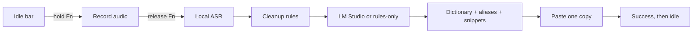

# JiSpr Flow

Local-first desktop dictation for macOS, Windows, and Linux. Speak into a
push-to-talk or hands-free session; local Whisper or Parakeet transcribes; deterministic
rules and an optional local LM Studio model clean the text; JiSpr inserts one
polished copy into the focused app.

Audio stays on your computer. Transcripts are sent only to your configured
local LM Studio server, if enabled. Known cloud AI endpoints are refused.

> The product is **JiSpr Flow**. The command and Python package remain
> `local-flow` and `local_flow`.

## Ultra-fast local setup: Parakeet + S1-mini MLX

For responsive English dictation on Apple Silicon, pair **Parakeet v3** for
speech recognition with **S1-mini by Superwhisper, MLX 8-bit** for writing
polish. Parakeet turns your voice into text; S1-mini removes fillers, handles
self-corrections, and formats punctuation and spoken numbers. Both run locally.

After [building and launching JiSpr](#new-machine-start-here):

1. Install **FFmpeg**, which Parakeet requires. The bootstrap script installs
   Python dependencies but does not install this system executable. With
   [Homebrew](https://brew.sh/):

   ```bash
   brew install ffmpeg
   ffmpeg -version
   ```

   Complete this step before selecting Parakeet. If JiSpr already reported
   missing FFmpeg, quit and reopen JiSpr after installation.
2. In LM Studio, download and load
   [S1-mini MLX 8-bit](https://huggingface.co/mlx-community/S1-mini-MLX-8bit),
   then start the local server under **Developer → Start Server**.
3. Open JiSpr **Settings → Models → Speech Recognition**. Set Preset to
   **custom**, Backend to **mlx-parakeet**, Model to
   `mlx-community/parakeet-tdt-0.6b-v3`, and Language to **en**.
4. Under **Writing Polish**, select Backend **lmstudio**, click **Refresh**,
   and explicitly choose **S1-mini by Superwhisper (s1-mini-mlx)**, or the
   corresponding S1-mini MLX identifier shown by your server.
5. Click **Save Changes**, wait for **Ready**, then hold **Fn** to dictate.

This setup uses the **custom** recognition preset. For a lighter speech
model, choose the existing **fast** preset (Whisper Small English) and
keep S1-mini selected for polish. See [S1-mini's supported behavior and
limits](#s1-mini-by-superwhisper-english-writing-polish) before using custom
instructions or rewriting features.

For hardware planning, allow **16 GB of unified memory**, or **24 GB** for
comfortable multitasking. These are recommendations, not measured minimums.
Actual response time depends on the Mac, recording length, and whether models
are already loaded. End-to-end speed comparisons remain to be measured.

## New machine? Start here

**The native macOS app (JiSpr) is the primary way to run this.** The Python
`local-flow` engine underneath it is a component, not the finished product — stop
after `uv sync` and you have the engine only, not the app.

**1. Get the actual latest.** There are no tagged releases, so "latest" is always
the tip of `main`:

```bash
git clone https://github.com/jayozer/jispr_flow.git   # fresh machine
# ...or, in an existing clone:
git checkout main && git pull
```

**2. Verify you really have it** — a fork or a stale branch looks just like a good
clone. All four must be true:

```bash
git remote -v              # points at github.com/jayozer/jispr_flow
                           # (if it's your fork, add an `upstream` remote or re-clone)
git branch --show-current  # prints: main
git status                 # says "up to date with 'origin/main'"
ls macos/JiSpr             # exists — this directory IS the native app
```

If `macos/JiSpr/` is missing you do **not** have the app; fix the remote/branch above.

**3. Build and launch the app** — one command does the whole thing:

```bash
./script/bootstrap.sh
```

It checks prerequisites (full Xcode, `uv`, `xcodegen`), installs the engine,
generates the Xcode project, then builds and launches JiSpr.app. See
[Native macOS app (JiSpr)](#native-macos-app-jispr) for the step-by-step version and
the manual follow-up (LM Studio, permissions, model selection).

## Quick start: Apple Silicon Mac

> This runs the **dictation engine directly from the command line** — no app. For
> the native menu-bar app (recommended), see
> [New machine? Start here](#new-machine-start-here).

Requirements: [uv](https://docs.astral.sh/uv/), macOS microphone permissions,
and optionally [LM Studio](https://lmstudio.ai/) with a local instruct model
loaded and its server running.

```bash
git clone <repository-url>
cd jispr_flow
uv sync --all-extras
uv run local-flow setup
```

For the recommended accurate local setup, edit
`~/.config/local-flow/config.toml` or use the native Settings app:

```toml
asr_profile = "accuracy"
asr_language = "en"

# Optional local-LLM cleanup. Use rules to run without LM Studio.
polish_backend = "lmstudio"
lmstudio_model = ""

floating_pill = true
pill_style = "compact"
hotkey = "fn"
```

Then verify and run:

```bash
uv run local-flow check
uv run local-flow demo
uv run local-flow run --pill
```

Hold **Fn**, speak, and release. Press **Esc** while recording to discard.
The first MLX run downloads the selected model once; later launches use the
local cache.

Without a prior `uv sync`, the equivalent one-shot command is:

```bash
uv run --extra mlx-asr --extra audio --extra desktop local-flow run --pill
```

### S1-mini by Superwhisper (English writing polish)

S1-mini works after Whisper or Parakeet: speech recognition produces text,
then S1-mini cleans up that text locally through LM Studio.

1. In LM Studio, download and load
   [S1-mini MLX 8-bit](https://huggingface.co/mlx-community/S1-mini-MLX-8bit)
   for the Apple Silicon setup above, and start the local server. The official
   [S1-mini GGUF](https://huggingface.co/superwhisper/s1-mini-GGUF), such as
   `s1-mini-q4_k_m.gguf`, is also supported. Switching between these formats
   does not require a JiSpr code change.
2. In JiSpr **Settings → Models → Writing Polish**, keep Backend set to
   **lmstudio**, click **Refresh**, and select **S1-mini by Superwhisper**.
3. Click **Save Changes**. JiSpr restarts its engine to apply the selection.
   After updating JiSpr's source, rebuild/relaunch the app first with
   `./script/build_and_run.sh`.

JiSpr recognizes model ids such as `s1-mini`, `s1-mini-mlx`, `superwhisper/s1-mini`, and
`s1-mini-q4_k_m.gguf`. Keep `s1-mini` in its standard model name; arbitrary
custom aliases are not detected. CLI users set `LOCAL_FLOW_LMSTUDIO_MODEL`
to the exact id exposed by their LM Studio server. Select an explicit id
when several models are available; Auto-select uses the first server-listed model.

JiSpr supplies the exact S1-mini prompt, temperature zero, and non-thinking
assistant prefix automatically. It uses LM Studio's
[raw completion endpoint](https://lmstudio.ai/docs/developer/openai-compat/completions),
so the LM Studio chat thinking toggle does not affect JiSpr's requests.

Supported behavior and limits:

- **English only.** A configured non-English ASR language uses rules. `auto`
  does not identify the transcript language for polish; use S1-mini with English
  dictation, or select a multilingual general-purpose model for mixed languages.
- Built-in **default**, **professional**, **casual**, **chat**, and **email** styles
  map to S1-mini's supported controls. Default/professional/casual allow lists;
  chat uses prose; email enables email layout. Cleanup **none** stays verbatim;
  light/medium use S1-mini normalization; high uses the same normalization with
  a warning because S1-mini does not offer general rewriting.
- Focused-field context is not sent to S1-mini. Custom system instructions or
  edited/custom styles use rules with a warning instead of silently ignoring
  those instructions. Select Gemma or another general-purpose model to use them.
- Utterances containing spoken commands, code-syntax commands, dictionary
  additions, or snippet triggers use rules so those phrases survive. Dictionary
  spelling is still enforced; a model response that removes a matched dictionary
  term or invents a command is rejected.
- Longer transcripts split at sentence boundaries into at most 16 requests, each
  with at most 800 UTF-8 bytes of transcript (a conservative token bound).
  Oversized single sentences and emails requiring multiple requests use rules.
  Partial, malformed, timed-out, or failed output falls back for the entire
  utterance, with no partial insertion. Empty output is accepted only for
  filler/noise input; meaningful speech is retained if the model returns blank.
- General transforms and command mode require a general-purpose model. If
  S1-mini is selected, those actions report an actionable error; auto-transform
  keeps the cleaned transcript and warns. Select Gemma again to restore its
  existing polish, context, and rewriting behavior.

No new Python dependencies or bundled model weights are required. The weights
remain managed by LM Studio. Model terms are in the publisher's
[license](https://huggingface.co/superwhisper/s1-mini/blob/main/LICENSE).

## What a session does


```mermaid
flowchart LR
    Idle[Idle bar] -->|hold Fn| Record[Record audio]
    Record -->|release Fn| ASR[Local ASR]
    ASR --> Rules[Cleanup rules]
    Rules --> Polish[LM Studio or rules-only]
    Polish --> Personalize[Dictionary + aliases + snippets]
    Personalize --> Insert[Paste one copy]
    Insert --> Success[Success, then idle]
```

The compact floating surface stays as a thin idle bar. It expands while
recording, shows processing after release, briefly confirms success, and then
returns to idle. Use `--no-pill` to hide it or set
`LOCAL_FLOW_PILL_STYLE=expanded` for the larger labeled version.

LM Studio does **not** run Whisper. JiSpr runs MLX/faster-whisper directly for
speech recognition and uses LM Studio only for optional text cleanup and
transforms.

Parakeet v3 is also loaded directly by JiSpr; LM Studio never receives audio.
Install its adapter and FFmpeg, then select it as a custom backend:

```bash
brew install ffmpeg
uv sync --extra parakeet-asr
```

```toml
asr_profile = "custom"
asr_backend = "mlx-parakeet"
asr_model = "mlx-community/parakeet-tdt-0.6b-v3"
asr_language = "auto"
```

Parakeet v3 manages multilingual recognition itself. It does not currently
accept JiSpr's Whisper vocabulary prompt; dictionary terms are still supplied
to local polish and deterministically enforced on the final text.

## Recognition profiles

| Profile | Model | Best for |
|---|---|---|
| `accuracy` | MLX Whisper Large-v3-Turbo | recommended accuracy/speed balance on the evaluated Mac |
| `fast` | MLX Whisper Small.en | lowest latency and memory use |
| `custom` | configured backend and model | faster-whisper, multilingual, or custom paths |

```toml
asr_profile = "fast"
# or
asr_profile = "accuracy"
```

On one 11.3-second technical sample, Turbo reduced WER from `0.190` to
`0.048` versus Small.en while median transcription increased from `0.129s`
to `0.153s`. Results depend on hardware and voice; reproduce them with:

```bash
uv run local-flow benchmark-asr sample.wav --profile fast \
  --reference "expected words" --json /tmp/fast.json
uv run local-flow benchmark-asr sample.wav --profile accuracy \
  --reference "expected words" --json /tmp/accuracy.json
```

See [MLX evaluation](docs/asr/MLX_EVALUATION.md) for the complete methodology.

## Model benchmark

`benchmark-models` freezes one ASR transcript per recording, then sends that
byte-identical text through each requested LM Studio model. Raw audio,
transcripts, and review sheets belong under the ignored `benchmarks/private/`
directory.

```bash
uv run local-flow benchmark-models benchmarks/private/corpus.jsonl \
  --output benchmarks/private/parakeet-v3 \
  --polisher gemma-4-26B-A4B-it-UD-Q4_K_M.gguf \
  --polisher Qwen3.5-35B-A3B-Q4_K_M.gguf \
  --polisher Qwen3.5-9B-Q4_K_M.gguf
```

Complete the generated blind review sheet before applying `--reviews` together
with the saved `--benchmark-report`; JiSpr evaluates those exact saved outputs
without calling ASR or LM Studio again. It never emits a recommendation before
every output has a safety decision. To compare Whisper Turbo with the winner,
rerun the same manifest with
`--asr-backend mlx-whisper --asr-model mlx-community/whisper-large-v3-turbo`.
See [the benchmark guide](benchmarks/README.md) for the full procedure.

## Names, vocabulary, and corrections

JiSpr uses three safe correction layers:

1. dictionary terms bias Whisper before decoding;
2. the local polish model is told the canonical spellings;
3. dictionary and snippet rules enforce the final output.

The dictionary fixes exact spelling and casing. Use snippets as explicit
aliases for pronunciation-dependent ASR results; JiSpr intentionally avoids
broad fuzzy autocorrect that could change valid words.

`~/.local/share/local-flow/dictionary.json`:

```json
{
  "terms": ["JiSpr Flow", "PostgreSQL", "Kubernetes"]
}
```

`~/.local/share/local-flow/snippets.json`:

```json
{
  "snippets": {
    "juiceflow": "JiSpr Flow",
    "GSPR Flow": "JiSpr Flow",
    "sig block": "Best regards,\nJay"
  }
}
```

You can also say `add JiSpr Flow to the dictionary`, or review terms mined
from local history:

```bash
uv run local-flow learn
uv run local-flow learn --add 1 2
```

## Everyday commands

| Command | Purpose |
|---|---|
| `uv run local-flow run --pill` | push-to-talk dictation with the macOS bar |
| `uv run local-flow run --mode hands-free` | VAD-controlled dictation |
| `uv run local-flow check` | inspect models, LM Studio, microphone, and desktop setup |
| `uv run local-flow transcribe memo.m4a --polish` | transcribe an existing audio file |
| `uv run local-flow history` | list local dictation history |
| `uv run local-flow history --retry 1` | re-polish and insert a previous rough transcript |
| `uv run local-flow recover` | process audio preserved after a crash |
| `uv run local-flow transform Polish --selection` | rewrite selected text in place |
| `uv run local-flow pad --window` | open the local Markdown scratchpad |
| `uv run local-flow stats` | show local words, streaks, and app statistics |
| `uv run local-flow tray` | start the menu-bar app |
| `uv run local-flow settings` | open native macOS Settings & Personalization |
| `uv run local-flow benchmark-models …` | freeze ASR and compare local polishers |

Run `uv run local-flow --help` or `<command> --help` for every option.

## Native macOS app (JiSpr)

The native SwiftUI menu-bar app under `macos/JiSpr` is the recommended way to run
JiSpr on macOS. It drives the same local Python dictation engine behind a
redesigned menu bar and Settings UI, with Launch at Login and recovery if the
engine stops unexpectedly. It lives as a waveform icon in the menu bar (no Dock
icon); closing Settings leaves it running there — use the icon's **Quit JiSpr**
action to stop the app.

> **Fast path:** from a checkout on the latest `main`, `./script/bootstrap.sh` does
> step 1 (engine install) and the `xcodegen generate` + build/launch of step 3 in
> one command. It only *checks* for full Xcode — it does **not** run the one-time
> `sudo xcode-select` / `xcodebuild -license accept` commands in step 3, so do those
> first if you haven't. The numbered steps remain the manual equivalent, plus the
> parts a script can't do (LM Studio, permissions, model selection).

### Requirements

- Apple Silicon Mac, macOS 14 or later
- [uv](https://docs.astral.sh/uv/)
- **Full Xcode** (not just the Command Line Tools) — required to build the app
- [LM Studio](https://lmstudio.ai) for writing polish (optional — without it,
  JiSpr falls back to deterministic rules-only cleanup)

### 1. Build the dictation engine

```bash
uv sync --all-extras      # audio + asr + desktop + tray extras
uv run local-flow check   # optional: verify mic / ASR / clipboard / LM Studio
```

Plain `uv sync` installs only the core (`httpx`). Without `--all-extras` the
engine cannot capture the microphone or run local speech recognition.

### 2. Set up LM Studio (writing polish)

For the [ultra-fast local setup](#ultra-fast-local-setup-parakeet--s1-mini-mlx),
select **S1-mini MLX 8-bit** using the steps above. Gemma remains an option for
general rewriting and custom instructions; the example below installs it.

LM Studio downloads models from Hugging Face, which **requires authentication** —
anonymous downloads return `HTTP 403`.

1. Authenticate with Hugging Face (any one of):
   - Add a Hugging Face **Read** token in LM Studio's settings, or
   - `launchctl setenv HF_TOKEN <token>`, then fully quit and reopen LM Studio, or
   - `uv run hf auth login`
2. Download a model, for example:
   ```bash
   uv run hf download lmstudio-community/gemma-4-12B-it-MLX-4bit \
     --local-dir ~/.cache/lm-studio/models/lmstudio-community/gemma-4-12B-it-MLX-4bit
   ```
3. In LM Studio, load the model and start the local server:
   **Developer → Start Server** (defaults to `http://localhost:1234`).

### 3. Build and launch JiSpr.app

Building the SwiftUI app needs full Xcode. Point the toolchain at it and accept
the license (one time):

```bash
sudo xcode-select -s /Applications/Xcode.app/Contents/Developer
sudo xcodebuild -license accept
sudo xcodebuild -runFirstLaunch
```

Then build and run — the Debug build is wired to this repo's `.venv` engine:

```bash
xcodegen generate --spec macos/JiSpr/project.yml   # first time / after project.yml changes
./script/build_and_run.sh --verify
```

### 4. Grant permissions, then restart the app

On first launch, grant **JiSpr** the following in
**System Settings → Privacy & Security**:

- **Microphone**
- **Accessibility**
- **Input Monitoring** (use the *Request Access* button in JiSpr's General settings)

> **Restart JiSpr after granting.** The global Fn hotkey tap is created at launch,
> so a running instance will not pick up a new grant — the
> *"Fn hotkey needs permission"* banner clears only after you quit and reopen the
> app, even though the toggles already read *Granted*.

### 5. Configure the models in Settings

JiSpr has **two independent model stages** — don't confuse them:

| Stage | Where | Value |
|---|---|---|
| Speech recognition (voice → text) | Settings → Models → **Speech Recognition** | Backend `mlx-parakeet`, model `mlx-community/parakeet-tdt-0.6b-v3`; or a Whisper preset |
| Writing polish (text → clean text) | Settings → Models → **Writing Polish** | Backend `lmstudio`, model `s1-mini-mlx` for English cleanup; or Gemma for general rewriting |

- If a speech model won't fully load under the **custom** preset, switch
  **Preset → accuracy**.
- In **Writing Polish**, set the backend to `lmstudio`, click **Refresh**, and
  **explicitly select** your polish model (e.g. `s1-mini-mlx`). Leaving it
  blank auto-selects the first loaded model, which can be the wrong one when an
  embedding model is also loaded in LM Studio.

### Troubleshooting

| Symptom | Cause / fix |
|---|---|
| Model download fails with **HTTP 403** | Not a network/proxy issue — Hugging Face requires auth. Add an `HF_TOKEN` or log in (step 2). |
| `xcodebuild` reports "requires Xcode" or a license error | Only Command Line Tools are active. Run the `xcode-select` + `-license accept` commands (step 3). |
| *"Fn hotkey needs permission"* despite **Granted** | Quit and relaunch JiSpr — grants only apply to a freshly launched process (step 4). |
| Polish output looks unchanged (rules-only) | LM Studio server isn't running, or the wrong LM Studio model is selected (steps 2 & 5). |

### Packaging a beta build (optional)

The Debug build resolves the engine from this checkout's `.venv/bin/local-flow`.
The Release pipeline bundles that engine and its Python runtime into the app:

```bash
./script/package_beta.sh
```

Without a Developer ID certificate this produces an ad-hoc DMG for local
validation only. With Developer ID and a notarytool Keychain profile it creates
the signed, notarized friend beta. See
[Beta distribution](docs/BETA_DISTRIBUTION.md). The legacy `local-flow tray` and
`local-flow settings` commands remain available as fallbacks during beta testing.

## Important settings

Copy [.env.example](.env.example) for the complete annotated list. Environment
variables override [local-flow.example.toml](local-flow.example.toml), which
overrides application defaults.

| Setting | Values / purpose |
|---|---|
| `LOCAL_FLOW_ASR_PROFILE` | `accuracy`, `fast`, or `custom` |
| `LOCAL_FLOW_POLISH_BACKEND` | `lmstudio` or deterministic `rules` |
| `LOCAL_FLOW_LMSTUDIO_MODEL` | loaded local instruct model; empty auto-selects |
| `LOCAL_FLOW_LMSTUDIO_SYSTEM_PROMPT` | optional extra cleanup instructions |
| `LOCAL_FLOW_MODE` | `push-to-talk` or `hands-free` |
| `LOCAL_FLOW_HOTKEY` | `fn`, `space`, `f9`, or another supported key |
| `LOCAL_FLOW_CLEANUP_LEVEL` | `none`, `light`, `medium`, or `high` |
| `LOCAL_FLOW_INSERT_METHOD` | `auto`, `paste`, `type`, or `clipboard` |
| `LOCAL_FLOW_MIC_PRIORITY` | comma-separated device-name preferences |
| `LOCAL_FLOW_VAD_PRESET` | `normal` or `whisper` for quiet speech |
| `LOCAL_FLOW_DATA_DIR` | personalization, history, notes, and recovery data |

Personal data defaults to `~/.local/share/local-flow`. Do not commit `.env`,
history, dictionaries, notes, or generated audio.

## Permissions and common fixes

On macOS, grant the process you launch—your terminal for CLI use, or **JiSpr**
for the native beta—**Microphone**, **Accessibility**, and **Input Monitoring**
access under System Settings → Privacy & Security, then restart it.
In JiSpr, open **General → Permissions** and click **Request Access** first; this
registers the native app so it appears in the corresponding macOS privacy list.

Settings writes validated TOML only. Legacy `.env` settings remain read-only
until migrated with `uv run local-flow migrate-config --apply`; true
parent-process overrides always remain read-only.

- No bar: run with `--pill` and confirm `LOCAL_FLOW_FLOATING_PILL=true`.
- Bar appears but no recording: check Microphone and Input Monitoring access.
- Text reaches the clipboard but not the app: grant Accessibility access or
  set `LOCAL_FLOW_INSERT_METHOD=clipboard` and paste manually.
- LM Studio unavailable: dictation still inserts rules-only text; start its
  local server when you want model polish.
- Unexpected spelling: add the canonical dictionary term and an exact snippet
  alias for the observed ASR output.
- Process interrupted after capture: run `uv run local-flow recover`.
- Wayland: use hands-free mode and clipboard insertion; global hotkeys and
  synthetic typing are commonly blocked by the compositor.

## Documentation

- [Architecture 2.0](architecture20.md): complete pipeline, thread model,
  advanced features, configuration groups, platform behavior, and recovery.
- [Adapter overview](docs/architecture.md): short code-oriented architecture.
- [MLX evaluation](docs/asr/MLX_EVALUATION.md): benchmark harness and results.
- [Roadmap](ROADMAP.md): product sequencing and remaining work.
- [Contributor guide](AGENTS.md): repository conventions and validation.

## Development

```bash
uv run pytest
uv run ruff check .
uv run local-flow demo
```

MIT licensed. JiSpr Flow is not affiliated with or derived from Wispr Flow or
any other proprietary dictation product.
