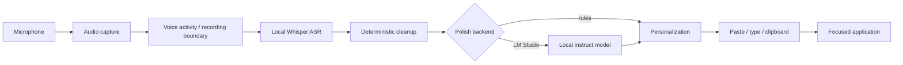
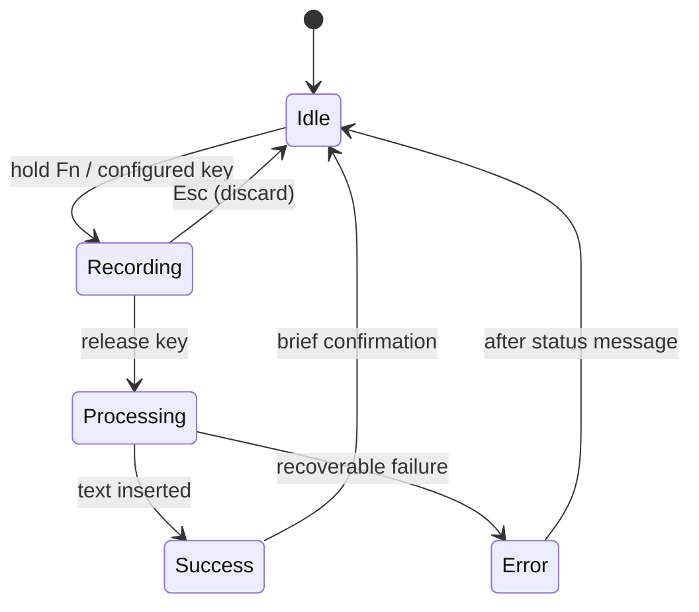

# JiSpr Flow Architecture 2.0

This document is the technical and advanced-usage reference for JiSpr Flow.
The [README](README.md) stays intentionally short and focuses on installing,
configuring, and running the app.

## Design goals

JiSpr Flow is a local-first desktop dictation system built from replaceable
adapters. Audio and models remain on the user's machine. A local LM Studio
server may receive transcripts and nearby field context for text cleanup, but
known cloud AI endpoints are rejected.

The architecture favors:

- independent ASR, polish, personalization, and insertion stages;
- graceful degradation when an optional service is unavailable;
- deterministic corrections for user vocabulary;
- platform code isolated behind small interfaces;
- headless tests for every core behavior;
- crash recovery without retaining audio after successful insertion.

## End-to-end pipeline



The personalization stage runs after model polish so a model cannot undo a
canonical spelling or consume a spoken command. Its order is:

1. canonical dictionary enforcement;
2. snippet and explicit alias expansion;
3. dictation commands such as `new line` and `press enter`;
4. spoken code syntax such as `snake case user id`;
5. spoken dictionary additions;
6. optional named auto-transform;
7. insertion and local history recording.

## Push-to-talk session

The macOS compact pill is a view of this state machine, not a separate audio
or transcription service.



`local-flow run --pill` starts AppKit on the main thread and the dictation
loop on a worker. Pill updates are dispatched back to AppKit. Audio capture
uses a private thread per recording, while two serialized callback lanes keep
hotkey state responsive and prevent ASR, LM Studio, or clipboard operations
from overlapping.

On macOS, fixed insertion shortcuts use Quartz events rather than constructing
a pynput keyboard controller on the processing thread. This avoids a current
macOS Text Services Manager queue assertion while preserving Cmd+V, Return,
and Tab behavior.

## Component map

| Responsibility | Main code | Interface / implementation |
|---|---|---|
| Application wiring and CLI | `local_flow/app.py` | dependency construction and commands |
| Configuration | `local_flow/config.py` | env, TOML, validation, profiles |
| Audio capture | `local_flow/audio/` | `AudioSource`, sounddevice and mocks |
| Voice boundaries | `local_flow/audio/vad.py` | energy, WebRTC, and mock VAD |
| Speech recognition | `local_flow/asr/` | `Transcriber`, faster-whisper, MLX, mock |
| Text cleanup | `local_flow/polish/` | deterministic rules and `TranscriptPolisher` |
| Local LLM | `local_flow/llm/` | LM Studio OpenAI-compatible chat client |
| Personalization | `local_flow/personalization/` | JSON dictionary, snippets, styles |
| Insertion | `local_flow/insertion/` | paste, typing, clipboard, fake sink |
| Hotkeys | `local_flow/hotkeys/` | Fn/Quartz, Space, pynput, mouse |
| Floating pill | `local_flow/pill/` | state machine, reporter, AppKit surface |
| History and recovery | `local_flow/history/`, `local_flow/audio/recovery.py` | JSONL history and pending WAVs |
| Context and routing | `local_flow/context/` | frontmost app and field text adapters |
| Transforms | `local_flow/transforms/` | named prompts and selection replacement |
| Scratchpad and insights | `local_flow/scratchpad/`, `local_flow/insights/` | Markdown notes and local statistics |

## ASR architecture

LM Studio is not an ASR backend. Its local API supplies chat/completion
models, while Whisper runs directly through JiSpr's `Transcriber` adapters.
Keeping that boundary explicit allows ASR and text polish to be changed
independently.

### Profiles

`LOCAL_FLOW_ASR_PROFILE` is the future settings-UI switch:

| Profile | Backend and model | Intended use |
|---|---|---|
| `fast` | MLX `whisper-small.en-mlx` | lowest latency on Apple Silicon |
| `accuracy` | MLX `whisper-large-v3-turbo` | recommended accurate English mode on the evaluated Mac |
| `custom` | honors backend/model fields | faster-whisper, custom MLX, multilingual, or local paths |

An 11.3-second technical sample on the development Mac produced:

| MLX profile | Cached load | Median transcription | WER |
|---|---:|---:|---:|
| `fast` | `0.785s` | `0.129s` | `0.190` |
| `accuracy` | `2.385s` | `0.153s` | `0.048` |

Turbo reduced word error rate by 75% relative on that sample for a 24ms
median latency increase. Treat this as a directional result, not a universal
hardware ranking. The reproducible harness and broader results are in
[docs/asr/MLX_EVALUATION.md](docs/asr/MLX_EVALUATION.md).

### Vocabulary boosting

Before each transcription, the adapter asks the personalization store for the
current dictionary. Starred and frequently used terms are prioritized into a
bounded Whisper prompt. Changes are picked up on the next utterance without
restarting the app.

Vocabulary prompting is a decoding hint, not a guaranteed correction. JiSpr
therefore applies deterministic dictionary and snippet rules after polish.

The MLX adapter also replaces tqdm's default multiprocessing lock with a
thread-only reentrant lock. Transcription progress never needs a process-shared
lock, and avoiding one prevents Python's resource tracker from reporting a
leaked semaphore when a long-running desktop session shuts down.

### Benchmarking

```bash
uv run local-flow benchmark-asr sample.wav \
  --profile fast --reference "expected transcript" \
  --runs 3 --warmup 1 --json /tmp/asr-fast.json

uv run local-flow benchmark-asr sample.wav \
  --profile accuracy --reference "expected transcript" \
  --runs 3 --warmup 1 --json /tmp/asr-accuracy.json
```

The harness reports model-load time, individual and aggregate latency,
median/p95, real-time factor, transcript, and optional word error rate. It
does not write history or copy the source audio.

## Polish and correction architecture

### Cleanup levels

| Level | Rules | LM Studio | Behavior |
|---|---|---|---|
| `none` | no | no | ASR output remains verbatim; personalization still applies |
| `light` | yes | yes | fillers and grammar, no intentional rephrasing |
| `medium` | yes | yes | punctuation, capitalization, grammar, artifacts |
| `high` | yes | yes | concise rewrite while preserving meaning |

Set `LOCAL_FLOW_POLISH_BACKEND=rules` to retain deterministic cleanup without
calling LM Studio. If `lmstudio` is selected but unavailable, JiSpr inserts
rule-cleaned text and records a warning instead of losing the dictation.

`LOCAL_FLOW_LMSTUDIO_SYSTEM_PROMPT` appends user instructions to the protected
built-in system prompt. Dictation commands, snippet triggers, spoken code
syntax, dictionary additions, and return-only output remain protected.

### Dictionary and explicit aliases

`dictionary.json` contains canonical spellings. Matching is case-insensitive,
allows flexible spaces in multi-word terms, and records usage counts. It does
not perform broad fuzzy or phonetic replacement because that would introduce
unpredictable false positives.

Use snippets as deterministic aliases for ASR outputs observed in practice:

`~/.local/share/local-flow/dictionary.json`:

```json
{
  "terms": [
    {"term": "JiSpr Flow", "starred": true},
    "PostgreSQL",
    "Kubernetes"
  ]
}
```

`~/.local/share/local-flow/snippets.json`:

```json
{
  "snippets": {
    "juiceflow": "JiSpr Flow",
    "GSPR Flow": "JiSpr Flow",
    "sig block": "Best regards,\nJay"
  }
}
```

This creates three complementary layers:

1. dictionary terms bias Whisper;
2. the local LLM sees canonical spellings in its prompt;
3. exact observed aliases are replaced after polish.

Users can also say `add JiSpr Flow to the dictionary`. The command is removed
from inserted text and the term becomes available to the next transcription.
`local-flow learn` mines repeated proper nouns and technical tokens from local
history for review rather than silently learning them.

### Dictation commands and code syntax

Supported formatting commands include `new line`, `new paragraph`, `press
enter`, and `press tab`. Supported code phrases include:

- `camel case order total` -> `orderTotal`
- `snake case user id` -> `user_id`
- `all caps api key` -> `API KEY`

These are deterministic rules. Code conversion claims up to four following
words and stops at common connectors; it is intentionally disabled at cleanup
level `none`.

## LM Studio boundary

LM Studio is optional and used for text operations only:

- transcript cleanup and contextual formatting;
- typed or spoken command mode;
- named transforms;
- optional auto-transform before insertion.

JiSpr expects an instruct/chat model loaded in LM Studio and its local server
running, normally at `http://localhost:1234/v1`. A Whisper checkpoint shown in
LM Studio's model inventory is not a usable JiSpr ASR endpoint. Select Whisper
through the ASR profile/model settings and select an instruct model through
`LOCAL_FLOW_LMSTUDIO_MODEL`.

## Runtime modes

### Push-to-talk

The default on macOS is Fn. The Quartz listener consumes Fn while JiSpr is
running, preventing macOS Dictation from producing a duplicate transcript.
Space supports tap-to-type and hold-to-dictate on macOS and Windows. Other
pynput key names such as `f9` are supported where global hooks are available.

Esc discards the in-flight main recording. Mouse, command, and transform
listeners share serialized state so hotkey callbacks remain fast while model
work continues.

### Hands-free and streaming

Hands-free mode uses VAD to close an utterance after silence:

```bash
uv run local-flow run --mode hands-free
```

`LOCAL_FLOW_STREAMING=sentence` uses the shorter
`LOCAL_FLOW_STREAMING_PAUSE_MS` boundary and inserts chunks while speech
continues. Lower thresholds reduce latency but provide less context and make
mid-sentence splits more likely. `scratch that` only reaches text inside the
current chunk.

`LOCAL_FLOW_STREAMING=live-preview` repeatedly transcribes accumulated audio
for display. Preview text never enters insertion, history, or correction; the
final utterance follows the normal pipeline.

### Quiet speech and microphone selection

`LOCAL_FLOW_MIC_PRIORITY="AirPods,USB"` selects the first matching input
device. `local-flow check` lists devices and marks the chosen one.

`LOCAL_FLOW_VAD_PRESET=whisper` lowers the default energy threshold and
normalizes captured utterances before ASR. An explicitly configured non-default
energy threshold still wins.

## Insertion and app context

`LOCAL_FLOW_INSERT_METHOD=auto` tries:

1. copy and synthetic paste;
2. synthetic typing;
3. clipboard-only fallback.

The fallback chain prevents text loss. Per-app rules can change style and
insertion behavior in `<data dir>/app_styles.json`:

```json
{
  "com.tinyspeck.slackmacgap": "casual",
  "com.apple.mail": {"style": "email", "insert": "paste"},
  "terminal": {"insert": "type"}
}
```

Exact app identifiers win; otherwise the longest case-insensitive substring
match against app id or window title wins. Set
`LOCAL_FLOW_CONTEXT_STYLES=false` to disable frontmost-app routing.

With `LOCAL_FLOW_CONTEXT_AWARENESS=true`, macOS can read a capped tail of the
focused field and current selection so polish continues the existing tone and
reuses nearby spellings. The context is sent only to the configured local LM
Studio server, is not stored, and silently degrades when unavailable. Windows
and Linux currently provide no field-text adapter.

## Additional product surfaces

### History and recovery

Completed dictations are appended to `<data dir>/history.jsonl`. Each record
contains rough and final text, timestamp, duration, app, replacement count,
and whether local LLM polish succeeded.

```bash
uv run local-flow history
uv run local-flow history --verbose
uv run local-flow history --show 1
uv run local-flow history --reinsert-raw 1
uv run local-flow history --retry 1
uv run local-flow history --clear
```

When audio recovery is enabled, each finished recording is first saved under
`<data dir>/pending/` and deleted after successful handling. A crash between
those steps leaves a WAV for:

```bash
uv run local-flow recover
```

### Existing audio files

```bash
uv run local-flow transcribe memo.m4a --polish
uv run local-flow transcribe first.wav second.wav --copy --language en
```

Real ASR backends accept the formats supported by their decoder. File
transcription writes no live-dictation history and inserts into no app.

### Transforms and command mode

Named prompt transforms live in `<data dir>/transforms.json`:

```bash
uv run local-flow transform --list
uv run local-flow transform Polish --text "hey can u fix the bug pls"
uv run local-flow transform Polish --selection
uv run local-flow command "make this formal" --text "send it today"
```

`LOCAL_FLOW_TRANSFORM_HOTKEY` applies `LOCAL_FLOW_TRANSFORM_DEFAULT` to the
current selection. `LOCAL_FLOW_COMMAND_HOTKEY` records a spoken edit command
and applies it to the selection or last dictation. `LOCAL_FLOW_AUTO_TRANSFORM`
applies one named transform to every dictation immediately before insertion.

### Scratchpad

Scratchpad notes are Markdown files under `<data dir>/notes/`:

```bash
uv run local-flow pad --append "call the plumber"
uv run local-flow pad --show
uv run local-flow pad --list
uv run local-flow pad --use work
uv run local-flow pad --window
```

`LOCAL_FLOW_SCRATCHPAD_HOTKEY` toggles live dictation between the focused app
and the active note. The floating note window requires a Tk-enabled Python.

### Insights and tray

`local-flow stats` computes words, streaks, heatmaps, top apps, and applied
replacement counts from local history. `local-flow tray` provides menu-bar
state, notifications, and style/language switching. The native compact pill
is the recommended minimal recording surface on macOS.

## Configuration model

Precedence is:

1. `LOCAL_FLOW_*` environment variables and `.env`;
2. `local-flow.toml`, the user config, or `LOCAL_FLOW_CONFIG`;
3. application defaults.

The authoritative annotated references are [.env.example](.env.example) and
[local-flow.example.toml](local-flow.example.toml). Important groups:

| Group | Principal settings |
|---|---|
| ASR | `ASR_PROFILE`, `ASR_BACKEND`, `ASR_MODEL`, `ASR_LANGUAGE` |
| Polish | `POLISH_BACKEND`, `LMSTUDIO_MODEL`, `LMSTUDIO_SYSTEM_PROMPT`, `CLEANUP_LEVEL` |
| Capture | `MODE`, `HOTKEY`, `CANCEL_HOTKEY`, `MIC_PRIORITY`, `VAD_*` |
| Surface | `FLOATING_PILL`, `PILL_STYLE`, `LANGUAGES` |
| Personalization | `DATA_DIR`, `STYLE`, `CONTEXT_STYLES`, `CONTEXT_AWARENESS` |
| Delivery | `INSERT_METHOD`, `STREAMING`, `STREAMING_PAUSE_MS` |
| Safety | `AUDIO_RECOVERY`, `MAX_UTTERANCE_MIN`, `HISTORY_*` |
| Power features | `TRANSFORM_*`, `COMMAND_HOTKEY`, `AUTO_TRANSFORM`, `SCRATCHPAD_HOTKEY` |

## Local data layout

Default: `~/.local/share/local-flow`.

```text
dictionary.json       canonical vocabulary and ranking metadata
snippets.json         spoken triggers and explicit ASR aliases
styles.json           named polish styles
transforms.json       named AI rewrite prompts
app_styles.json       optional app-specific style/insertion rules
history.jsonl         local dictation history
notes/                Markdown scratchpad files
pending/              temporary recoverable recordings
```

All files are user-owned, hand-editable formats. `.env`, history, personal
dictionaries, notes, and pending audio must never be committed.

## Platform behavior

### macOS

Grant the terminal Microphone, Accessibility, and Input Monitoring access,
then restart it. Fn hotkeys, the AppKit pill, contextual field reading, and
Quartz insertion are native macOS paths. Apple Silicon supports MLX Whisper.

### Windows

Allow microphone access for desktop apps. Global hotkeys and synthetic input
cannot cross into an elevated application from a non-elevated process.

### Linux

X11 supports pynput; install `xclip` or `xsel`. Wayland generally blocks
global capture and synthetic typing. Use hands-free mode with
`LOCAL_FLOW_INSERT_METHOD=clipboard` and paste manually; `wl-clipboard` is
recommended.

## Failure behavior

- LM Studio unavailable: rules-only text is inserted with a warning.
- Paste unavailable: typing and then clipboard-only are attempted.
- Field context unavailable: polish proceeds without it.
- Optional secondary hotkey unavailable: that feature is disabled, not the
  dictation loop.
- Recorder fails to stop: the buffer is abandoned and cannot leak into a
  later focused field.
- Process dies after capture: pending audio remains for `recover`.
- ASR/model configuration invalid: startup fails with an actionable hint.

## Verification

Headless validation:

```bash
uv run pytest
uv run ruff check .
uv run local-flow demo
uv run local-flow check
```

Hardware acceptance on macOS:

1. Start `local-flow run --pill`; verify the idle bar is visible.
2. Hold Fn; verify recording state and live audio response.
3. Release; verify processing, one insertion, success, then idle.
4. Dictate a known alias; verify deterministic canonical output.
5. Dictate again; verify the process remains alive and the bar re-arms.
6. Stop LM Studio; verify rules-only insertion and a warning.
7. Kill the app during processing; verify `local-flow recover` handles the
   pending WAV.

## Extension points

New ASR, audio, VAD, LLM, or insertion implementations should satisfy the
existing small interface, live in the matching adapter package, import heavy
or OS-specific dependencies lazily, and ship with a mock-backed success and
failure test. Configuration additions must be reflected in `.env.example`,
`local-flow.example.toml`, validation tests, and this reference when they are
user-facing.

The shorter original adapter overview remains at
[docs/architecture.md](docs/architecture.md). Product sequencing lives in
[ROADMAP.md](ROADMAP.md).
