# I Built My Own Dictation App So I'd Never Rent My Voice

### JiSpr is a local-first, privacy-first dictation app for Apple Silicon. Speech recognition, voice-activity detection, and LLM cleanup all run on the Mac. Nothing leaves the machine. Here's how it's designed, every knob it exposes, and the one bug that ate a weekend.

*July 2026 · 15 min read*

---

## Why build this at all

I could have paid twenty dollars a month for a cloud dictation app. They're good. But three things kept nagging at me.

**Privacy.** Dictation is the most intimate input stream on my computer. It's my half-formed thoughts, client names, passwords I accidentally say out loud, the draft I'd never want logged. Sending that to someone else's server — even a reputable one — always felt like the wrong default. I wanted a tool where "your audio never leaves this Mac" wasn't a marketing bullet with an asterisk, but an architectural fact I could point at in the code.

**Speed.** A round trip to a cloud model has a floor no amount of engineering removes: the network. On-device, the floor is my own silicon.

**The machine.** I have an M5 MacBook Pro with 128 GB of unified memory. That is an absurd, wonderful amount of RAM to leave idle. A large Whisper model and a local instruct LLM can sit resident together and never touch swap. If I wasn't going to run real models locally on *this* hardware, when would I?

And honestly — **I wanted the challenge.** I wanted to see if I could build something I'd actually reach for every day, that was mine end to end, that lived on my machine and worked privately without asking anyone's permission. A subscription is a tool you rent. This is a tool that lives with me.

The result is **JiSpr**. Hold `Fn`, speak, release — polished text lands in whatever app has focus. This post is the full tour: the design, every option, and the engineering.

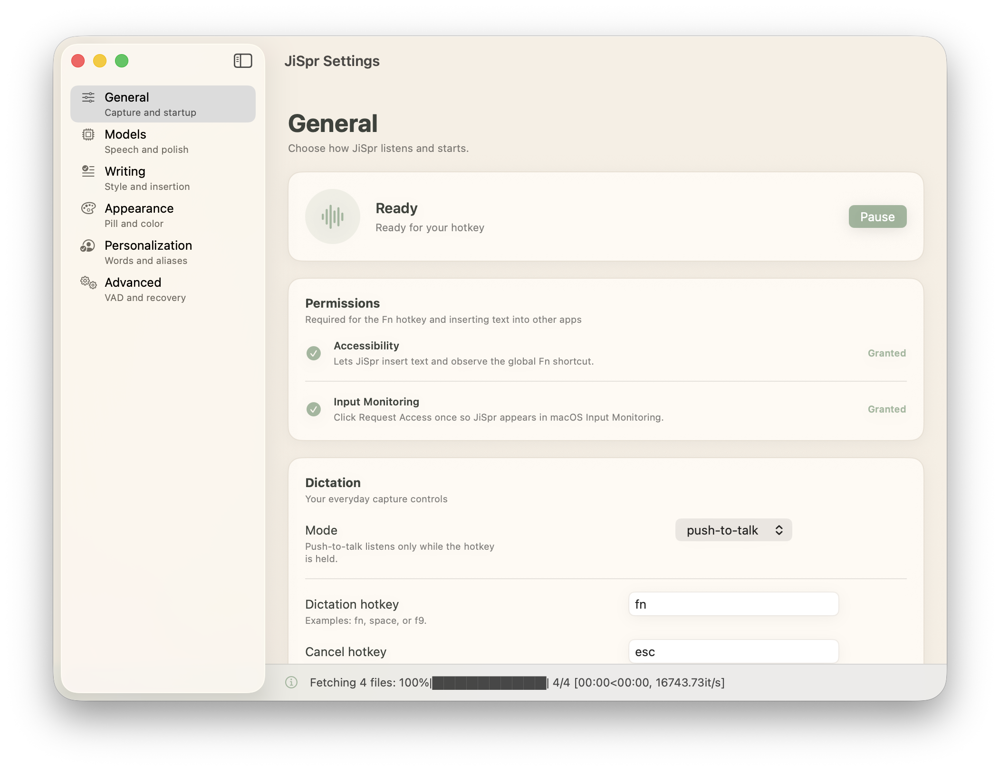

*The General tab. Hold `Fn` to talk, `Esc` to discard. Permissions are a first-class citizen here — more on why later.*

---

## The shape of the thing: two processes, one pipeline

JiSpr is two processes that trust each other and nothing else.

A **Swift menu-bar app** owns everything you see: the settings window, the menu-bar waveform, and a small floating status pill. It spawns an **embedded Python engine** that does all the actual work — capture, recognition, cleanup, insertion — and the two talk JSON over a pipe. The app is the face; the engine is the muscle. Neither one phones home.

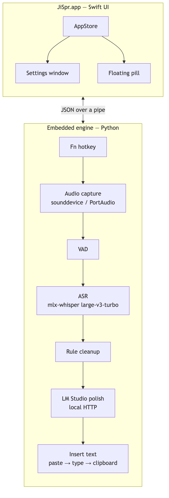

<details><summary>Mermaid source</summary>

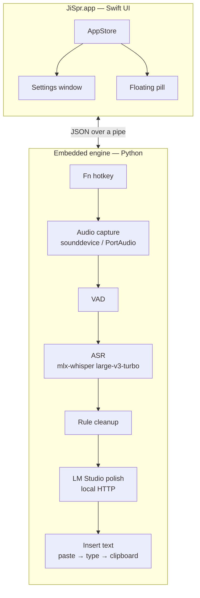
</details>

The engine itself is a **pipeline of small adapters**. Every stage is one interface with a real implementation *and* a mock:

| Stage | What it does | Real impl | Mock |
|---|---|---|---|
| **AudioSource** | yields 16-bit mono PCM frames | `sounddevice` / PortAudio | `MockAudioSource` |
| **VAD** | speech-vs-silence per frame, groups frames into utterances | energy threshold or WebRTC | `MockVAD` |
| **Transcriber** | PCM → rough text | faster-whisper, MLX Whisper, MLX Parakeet | `MockTranscriber` |
| **Rule cleanup** | deterministic filler removal, "scratch that", whitespace | pure Python | — (it's pure) |
| **LLM polish** | grammar/tone cleanup with your vocabulary | LM Studio HTTP | `MockChatClient` |
| **TextSink** | delivers the final text | clipboard-paste → typing → clipboard-only | `FakeTextSink` |

That "and a mock" column is not incidental — it's the whole reason the architecture holds together. Four design properties fall out of it:

1. **Testability.** CI has no microphone, no GPU, no Whisper model, no LM Studio server, no clipboard, no display. Because every stage is an interface, every behavior — *including* the ugly error paths like "LM Studio is down" and "paste failed" — runs headless with mocks. The full test suite is 1,197 tests and finishes in about three seconds on a bare machine.
2. **Platform isolation.** All the OS-specific code (PortAudio, `pynput`, Quartz, clipboard tools) lives in leaf modules, imported lazily behind optional extras. The core never imports them. A missing dependency raises an actionable error instead of crashing on import.
3. **Independent degradation.** ASR can work while LM Studio is down (fall back to rules-only, warn, keep going). Paste can fail while the clipboard still works (fall down the chain). Each stage fails on its own without taking the pipeline with it.
4. **Swappability.** whisper.cpp instead of faster-whisper? A different local LLM server? Silero VAD? Each is one new adapter class. No pipeline changes.

---

## What one dictation actually does

Here's a single utterance, end to end. Two things are worth calling out. First, the **two dispatcher lanes**: the hotkey callback runs on a fast lane and returns immediately, handing the audio to a FIFO processor lane — so slow ASR work can never swallow the first words of your *next* dictation. Second, the **crash-safety autosave** and the **degradation note**: if LM Studio isn't running, you still get clean, rules-only text plus a warning, not an error.

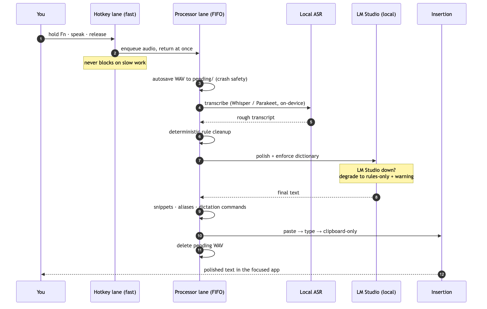

<details><summary>Mermaid source</summary>

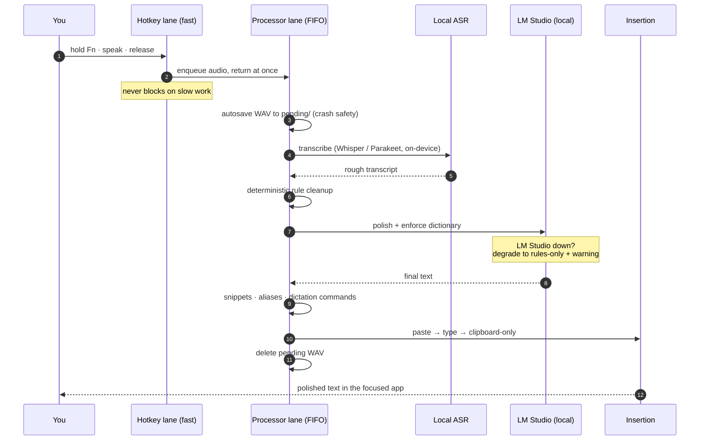
</details>

Now the tour of what you can actually tune — organized the way the settings window is.

---

## Models: the local stack you get to choose

This is the tab that makes the privacy claim real. **Audio never leaves this Mac; LM Studio stays on localhost.** Nothing here has a cloud option.

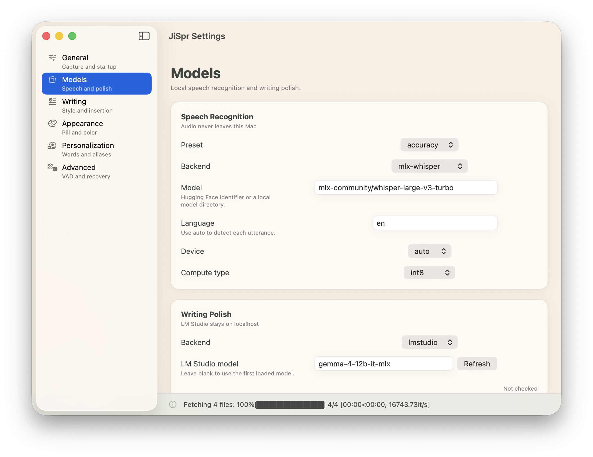

**Speech recognition** runs on one of three profiles:

- **`accuracy`** — MLX Whisper Large-v3-Turbo. The recommended balance on Apple Silicon, and what I run.
- **`fast`** — MLX Whisper Small.en. Lowest latency and memory.
- **`custom`** — bring your own backend and model: faster-whisper, a multilingual Parakeet v3, or a local model directory.

Is the accuracy jump real? On one 11.3-second technical sample, Turbo cut word error rate from **0.190 to 0.048** versus Small.en, while median transcription time rose only from **0.129s to 0.153s**. On a 128 GB machine, that trade is a no-brainer — I'll spend 24 milliseconds to quarter my error rate. (Reproduce it yourself with `local-flow benchmark-asr`.)

Crucially, **LM Studio never does speech recognition.** JiSpr runs Whisper or Parakeet directly. LM Studio only ever sees *text*, and only for optional cleanup. Parakeet, when you pick it, is loaded directly through `parakeet-mlx` — audio never touches the LLM server.

**Writing polish** is the second half. A local instruct model (here, `gemma-4-12b-it-mlx` served by LM Studio) takes the rough transcript plus your dictionary terms and style rules, and returns clean prose. The client **refuses known cloud AI endpoints at construction time** — you cannot accidentally point it at a hosted API. And if the LM Studio server is off, dictation still works; you just get deterministic rules-only output and a small warning.

---

## Personalization: teach it your words

Every dictation tool mangles proper nouns. JiSpr's answer is three safe correction layers, none of which do risky fuzzy autocorrect:

1. **Dictionary terms bias Whisper before decoding** — the model is nudged toward "PostgreSQL", "Kubernetes", "JiSpr Flow" before it ever guesses.
2. **The polish model is told the canonical spellings** — so it fixes what slips through.
3. **Dictionary and snippet rules enforce the final output** — deterministic, last word.

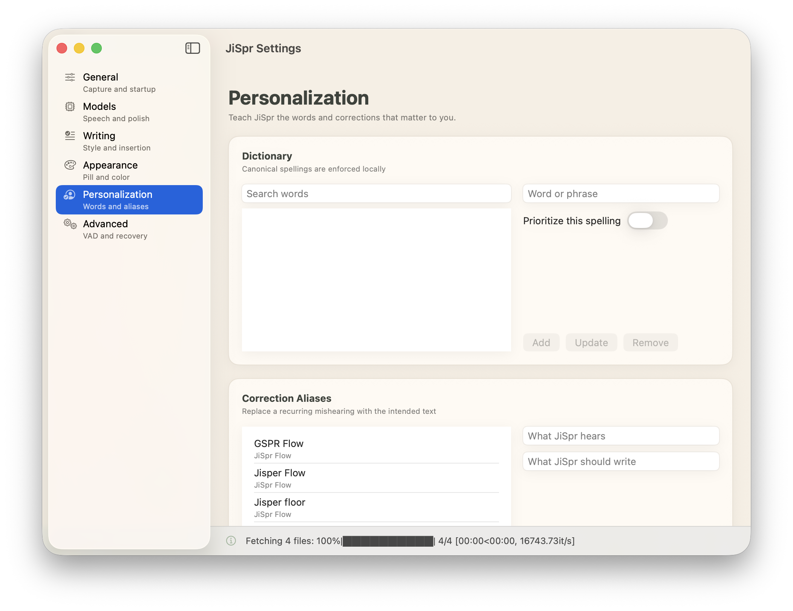

The **dictionary** fixes exact spelling and casing. **Correction aliases** handle the pronunciation-dependent misses — you map a recurring mishearing to the intended text. Those `GSPR Flow → JiSpr Flow` and `Jisper Flow → JiSpr Flow` entries in the screenshot are real: "JiSpr" is a made-up word, so Whisper hears it a dozen ways, and I just taught it each one. You can add terms by voice ("*add JiSpr Flow to the dictionary*") or mine them from your own history with `local-flow learn`.

All of this is hand-editable JSON in your data directory. Nothing is a black box; you can `cat` your own dictionary.

---

## Writing: shaping the text before it lands

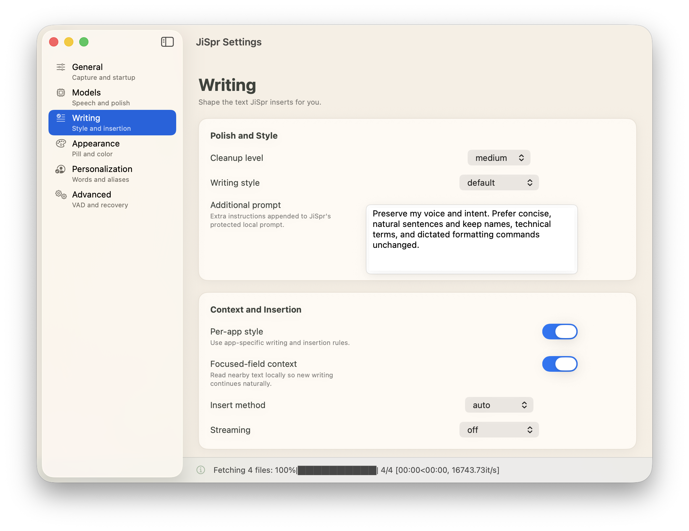

- **Cleanup level** — `none` (verbatim, zero LLM calls), `light` (fillers and grammar only), `medium` (the default), `high` (rewrite for concision). This is the master dial for how much the model is allowed to touch your words.
- **Writing style** and a free-text **additional prompt** that's appended to JiSpr's own protected polish instructions — mine says "preserve my voice and intent, keep names and technical terms and dictated formatting commands unchanged."
- **Per-app style** (`app_styles.json`) — the frontmost app can switch both the writing style *and* the insertion method. Casual in Slack, formal in Mail, raw text in a terminal.
- **Focused-field context** — best-effort, local reading of the text already in the field you're dictating into (the tail before the cursor, plus any selection), so the polish pass *continues* a sentence and matches tone instead of re-greeting. This context is sent only to your local LM Studio server and is never stored.
- **Insert method** — `auto`, `paste`, `type`, or `clipboard`. `auto` walks a fallback chain: clipboard-paste keystroke first, synthetic typing if that's blocked, clipboard-only as the floor. Every failure is reported, never swallowed.
- **Streaming** (hands-free only) — `sentence` mode shortens the pause that closes an utterance, so each sentence inserts while you're still speaking the next.

---

## Appearance: the pill

While you dictate, a small capsule sits near the bottom of the screen. It's a thin idle bar most of the time, expands and shows a live mic meter while recording, flashes a confirmation after insertion, and settles back. **Sage when ready, orange when active.** Compact stays out of your way; expanded shows labeled status.

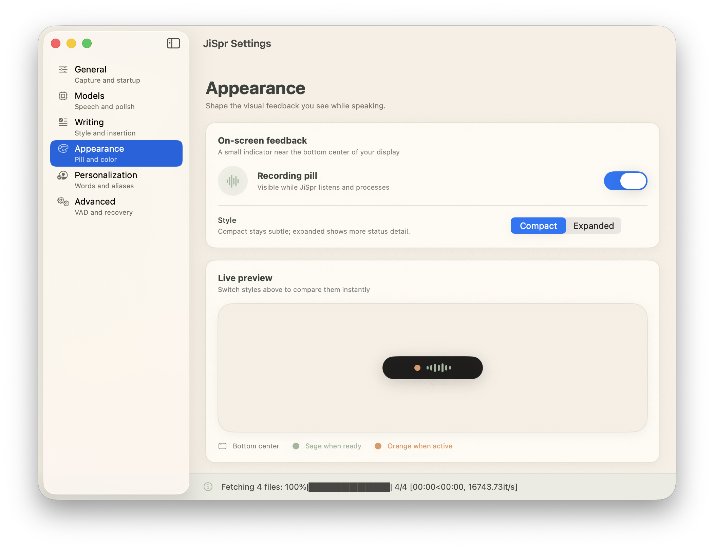

It looks like a throwaway detail. It hid one of the nastier bugs I found — we'll get there.

---

## Advanced: VAD, quiet speech, and crash safety

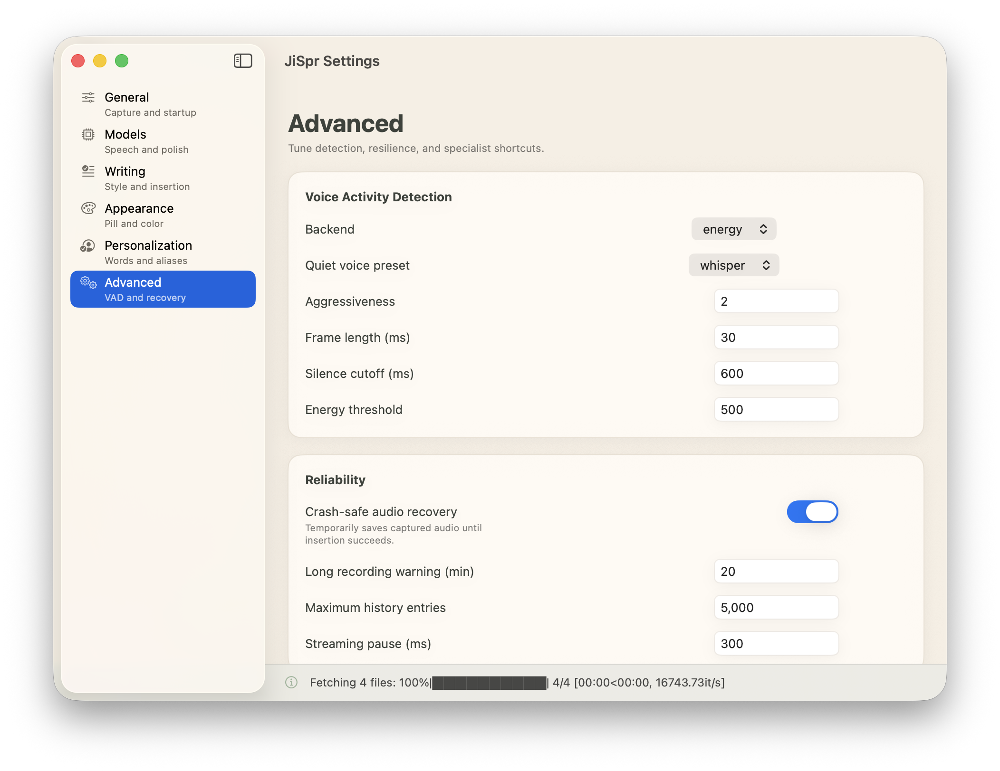

- **Voice Activity Detection** decides speech from silence. The default `energy` backend is dependency-free; `webrtc` is available. The knobs — aggressiveness, frame length, silence cutoff, energy threshold — are all here.
- **Quiet voice preset: `whisper`** (the confusingly-named-but-literal setting) lowers the energy threshold so the VAD catches actually-whispered speech. It matters for late-night dictation when you don't want to wake the house.
- **Crash-safe audio recovery** saves each utterance's raw PCM to a `pending/` folder *before* processing and deletes it once insertion succeeds. If JiSpr is force-quit mid-dictation, `local-flow recover` replays whatever's left. Nothing you said is lost to a crash.
- **Reliability** also covers the long-recording warning (a 20-minute utterance is usually a stuck hotkey, not intent), history retention, and streaming pause.

Beyond the tabs, the same engine powers a **local Markdown scratchpad** (`pad`), **append-only history** you can search and re-polish, **transform-in-place** and **voice-command** hotkeys that rewrite your current selection through the LLM, and local **stats** (words dictated, streaks). All of it, on your machine, in files you own.

---

## The hard part: the microphone that recorded silence

Everything above is the happy story. Here's the weekend I lost.

In development, dictation was flawless — the Swift app launched the engine straight out of a virtualenv. Then I packaged the beta *properly*: a Release build with the Python runtime embedded inside the bundle, everything signed with **Hardened Runtime**, installed into `/Applications`. I held `Fn`, spoke, and got:

> **no speech detected; nothing inserted**

Every single time. The logs said recording started and stopped on cue. Buffers arrived at the right sample rate. The duration matched how long I'd spoken. And every sample in every buffer was **zero.** Flat digital silence.

The reflexive suspects were all innocent. TCC microphone permission? Granted — the prompt had shown, I'd clicked yes, System Settings agreed. Wrong input device? No, same one that worked in dev. VAD threshold? No — the autosaved recovery WAVs were themselves silent.

What finally cracked it was asking the right question: *what is different between dev and the installed app?* The answer was the **code signature**. In dev, the engine is an unsigned virtualenv Python. Installed, it's an embedded Python runtime signed with Hardened Runtime — and a hardened process may only capture audio if it carries the `com.apple.security.device.audio-input` **entitlement.**

Here's the trap, and it's a good one: the TCC permission (the dialog the user sees) and the entitlement (the capability the *binary* declares) are two separate gates. You need both. And when the entitlement is missing, **Core Audio does not refuse the stream.** It opens happily, delivers buffers on schedule, and every sample is zero.

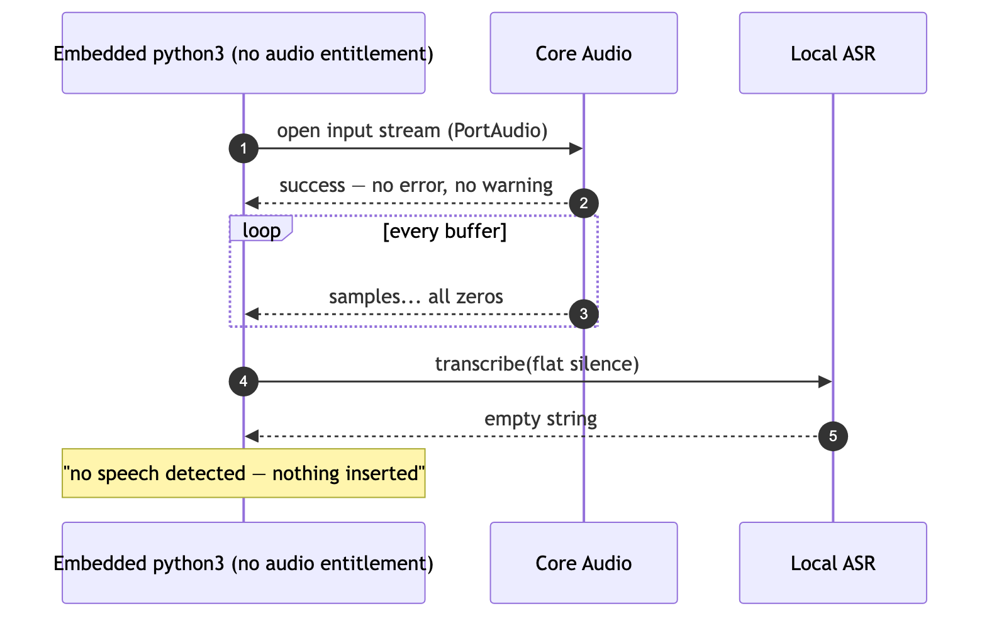

<details><summary>Mermaid source</summary>

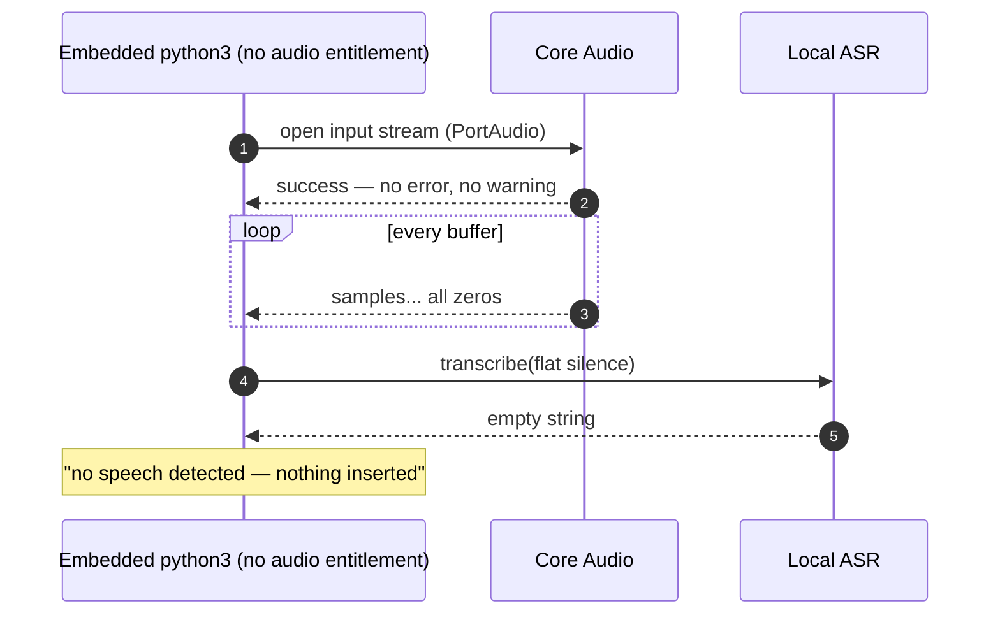
</details>

No error to catch. No log line to grep. The failure presented as *me mumbling* — the app's own message, "no speech detected," was technically accurate and completely misleading.

The fix is small once you know it's needed. The embedded Python gets the audio-input entitlement (alongside the JIT exceptions the MLX/Numba stack already needs), and the outer app declares the same capability — because JiSpr.app is the TCC "responsible process" for the engine it spawns, so the recorded consent belongs to the app:

```xml
<!-- python-runtime.entitlements -->
<key>com.apple.security.cs.allow-jit</key><true/>
<key>com.apple.security.cs.allow-unsigned-executable-memory</key><true/>
<key>com.apple.security.device.audio-input</key><true/>
```

The packaging script signs every embedded binary first, then the outer bundle with the app entitlements — in **both** its signing paths (ad-hoc for local builds, Developer ID for real ones), so a test build can never silently behave differently from the shipped one. Hold `Fn`, speak — actual words.

---

## Two more bugs the fix flushed out

**The app that broke its own seal.** With dictation working, `codesign --verify --deep --strict` started failing — but only *after* the first launch. The embedded Python was dutifully writing `__pycache__/*.pyc` files inside the signed bundle. Unsealed files in a sealed bundle break strict verification. One environment variable, set for the spawned engine, fixed it: `PYTHONDONTWRITEBYTECODE=1`. (Corollary, now a rule: never run the bundle's `python3` by hand — one stray import writes cache files into the seal.)

**The status pill that couldn't let go.** Automated review flagged a subtle one. After an insertion, the pill holds "Inserted" for 0.9 seconds before relaxing to idle — a deliberate beat. But in hands-free mode, the engine streams an `audio_level` update every ~30ms, *even while idle*. Each one re-entered the update path, invalidated the pending 0.9s timer, and scheduled a fresh one. The timer needed 0.9 seconds of quiet on the update channel — and never got it. The pill stuck on "Inserted" forever.


<details><summary>Mermaid source</summary>

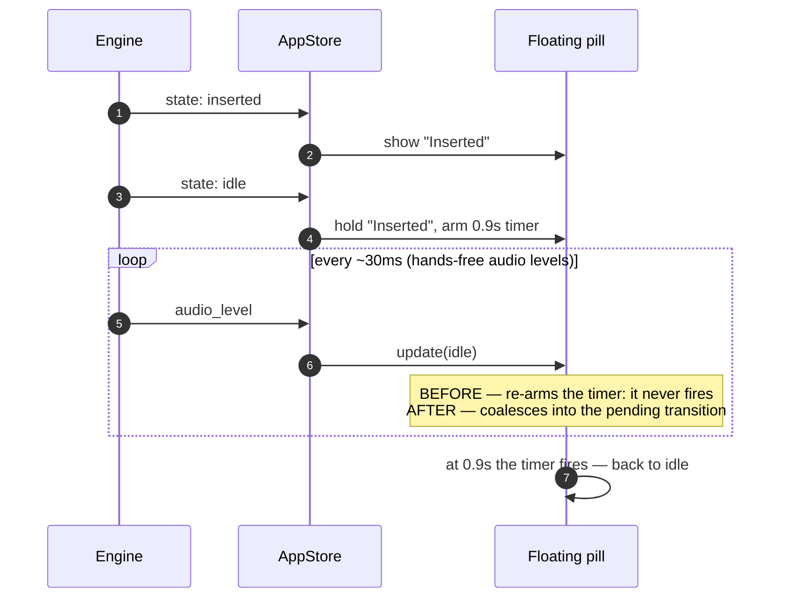
</details>

The fix pulled the decision into a pure, testable function: only the *first* idle update arms the timer; later refreshes coalesce into it without touching the deadline; any non-idle state cancels it. A five-line unit test now guards the livelock.

---

## How I keep it honest: tests and packaging

The through-line of all three bugs: each was invisible to a green test suite until it had a test of its own. So the packaging invariants are now pinned by tests that read the entitlement plists and the signing script, and run headless in CI with everything else:

```bash
uv run pytest tests/test_packaging_entitlements.py   # 4 passed
uv run pytest                                        # 1197 passed
uv run ruff check .                                  # clean
```

And the installed artifact gets interrogated after every build — because the one thing you cannot mock is the operating system's opinion of your signature:

```bash
# the app AND the embedded python must both carry audio-input
codesign -d --entitlements - /Applications/JiSpr.app
codesign -d --entitlements - \
  /Applications/JiSpr.app/Contents/Resources/engine/python/bin/python3
# the seal must survive strict verification…
codesign --verify --deep --strict /Applications/JiSpr.app
# …which means zero .pyc files inside the bundle
find /Applications/JiSpr.app/Contents/Resources/engine -name "*.pyc" | wc -l   # 0
```

The final acceptance test is one sentence, and no script can run it for me: **hold `Fn` and speak.**

---

## What I'd tell past me

- **On-device isn't a constraint here, it's the point.** The 128 GB machine runs Large-v3-Turbo and a 12B instruct model resident, together, with headroom. The privacy guarantee and the speed floor are the *same* decision as the hardware decision.
- **macOS security failures are often silent by design.** Core Audio zeroing your buffers instead of erroring is the sandbox working as intended. If a capability can be denied, go look at what *denied* actually looks like in your code — it's probably not an exception.
- **Entitlements and TCC are different gates.** The user saying "yes" is necessary, not sufficient. In a multi-process app, the binary *and* its responsible parent must both declare the capability.
- **Mocks make logic testable; they can't test the OS's opinion of a signed app.** The answer isn't fewer mocks — it's an explicit acceptance test on the installed artifact.

I set out to see whether I could build a dictation tool I'd actually use, that was mine, that worked privately without renting anything. It's on my machine now. Every word I speak into it dies on this laptop. The M5 finally has something worth its RAM — and I stopped renting my voice.

---

*JiSpr is built on a local-first Python engine (MLX / faster-whisper for ASR, LM Studio for optional polish) wrapped in a SwiftUI menu-bar app. All processing stays on-device; the only network call it will make is to a local LM Studio server, and it refuses known cloud endpoints by construction.*

*All diagrams in this post are also saved as PNGs in `images/` — paste them straight into Medium, which doesn't render Mermaid.*
